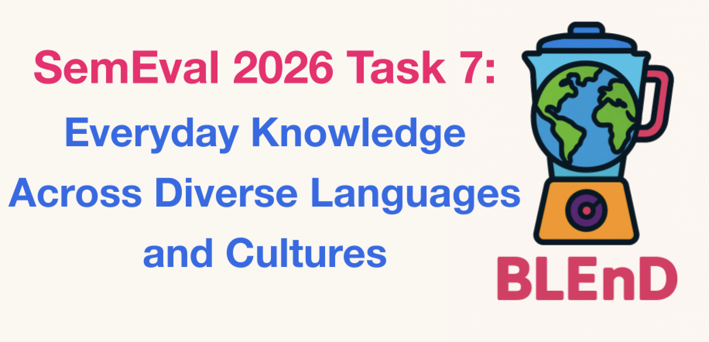

  

# SemEval 2026 Task 7: Everyday Knowledge Across Diverse Languages and Cultures
- ⚠️ **This is an evaluation-only task. Hence, BLEnD may **NOT** be used for fine-tuning or few-shot learning. However, any NLP system may be submitted and you are free to be as creative as you wish!**
- ❗🌐 **Competition website:** [CodaBench](https://www.codabench.org/competitions/10281/)
- 💡 **Discord channel:** [Join here](https://discord.com/invite/8x6XP97kmw) to ask questions and receive updates
- 🔧 **Questions or issues:** Please [create an issue](https://github.com/BLEnD-SemEval2026/SemEval-2026-Task-7/issues)
- ✉️ **Email organisers:** semeval-2026-blend-organisers[at]googlegroups[dot]com
- 💬 **Participants’ Google Group:** Request to join at [semeval-2026-task7-blend-participants[at]googlegroups[dot]com](https://groups.google.com/g/semeval-2026-task7-blend-participants)
# Content
- [📢 **News**](#-news)
- [Everyday Knowledge Across Diverse Languages and Cultures](#everyday-knowledge-across-diverse-languages-and-cultures)
- [Tracks](#tracks)
    - [Track 1: Short Answer Questions (SAQ)](#track-1-short-answer-questions-saq)
    - [Track 2: Multiple-Choice Questions (MCQ)](#track-2-multiple-choice-questions-mcq)
- [Evaluation](#evaluation)
- [Important Dates and Task Phases](#important-dates-and-task-phases)
- [How to Participate](#how-to-participate)
- [Competition Rules and Terms](#competition-rules-and-terms)
- [Dataset paper](#dataset-paper)
- [FAQs](#faqs)
- [Resources](#resources)
- [Organizers](#organizers)

# 📢 **News**
**Sep 2025**❗❗❗ The competition website is now live, register on [CodaBench](https://www.codabench.org/competitions/10281/)❗❗❗

**Aug 2025** ⚠️ The **pilot data** is available [here](https://github.com/BLEnD-SemEval2026/pilot_data).

# Everyday Knowledge Across Diverse Languages and Cultures
The global deployment of large language models (LLMs) and NLP systems requires cultural awareness. Yet, these models often lack culture-specific knowledge, particularly for under-served languages and regions. Their outputs frequently reflect Western-centric perspectives or stereotypes inherited from training data. Existing benchmarks, largely based on monolingual datasets or Wikipedia, often fail to capture the realities of everyday life across cultures.

This shared task aims to evaluate the cultural awareness of LLMs and NLP systems across multiple languages. We will use an extended version of the manually constructed BLEnD benchmark [(Myung et al., 2024)](https://proceedings.neurips.cc/paper_files/paper/2024/hash/8eb88844dafefa92a26aaec9f3acad93-Abstract-Datasets_and_Benchmarks_Track.html) as validation and test sets for several languages. BLEnD is specifically designed for evaluation and **will not be used for training**, ensuring that results reflect a model's ability to generalize to unseen, diverse cultural and linguistic contexts.

BLEnD currently covers 13 languages and 16 cultures. For this shared task, we will expand its scope to include 17 additional language–culture pairs.

The languages and cultures inncluded in our dataset are as follows (completed annotations from the original BLEnD are in bold):

| Area    | Language (Region)        |
|---------|--------------------------|
| Africa  | **Arabic (Algeria), Amharic (Ethiopia), Hausa (Northern Nigeria)**, Arabic (Egypt), Arabic (Morocco)|
| Asia    | **Assamese (Assam, India), Azerbaijani (Azerbaijan), Mandarin (China), Indonesian (Indonesia), Javanese (West Java, Indonesia), Persian (Iran), Korean (North Korea), Korean (South Korea)**, Arabic (Saudi Arabia), Japanese (Japan), Thai (Thailand), Bengali (India), Tagalog (Philippines), Tamil (Sri Lanka), Tamil (Singapore), Taiwaanese Mandarin (Taiwan), Singaporean Mandarin (Singapore), Malay (Singapore) |
| Australia | English (AU)|
| Europe  | **Greek (Greece), Spanish (Spain), English (UK)**, French (France), Bulgarian (Bulgaria), Welsh (Wales), Swedish (Sweden), Irish (Ireland), Basque (Basque Country)|
| North America | **English (US)** |
| Latin America | Spanish (Equador), **Spanish (Mexico)** |

# Tracks
## Track 1: Short Answer Questions (SAQ)
Participants will test their models on short-answer questions (SAQs) to ensure they can accurately generate responses while accounting for cultural and linguistic diversity. This track will include 26 languages. Given questions in a given language, responses will be tested in that language, and correctness will be determined based on alignment with human-annotated answers from BLEnD.

## Track 2: Multiple-Choice Questions (MCQ)
In this track, questions are provided in English only. Each question will come with four answer options, each representing a cultural perspective from a different country or region, i.e., the one that received the highest number of votes for a given country. To ensure fairness, questions are filtered to exclude those marked as culturally irrelevant or unclear by human annotators. Each multiple-choice question includes four answer options, with no more than one option representing any of the other countries or regions. The developed model is assessed based on its ability to identify the culturally appropriate choice for each question per region.

# Evaluation
We will evaluate each submission using accuracy based on the alignment of the generated answer with human annotations. Notably, our evaluation accounts for variations in responses, which ensures a more robust assessment. Specifically, in the SAQ track, a model-generated answer is marked as correct if it matches any of the responses provided by human annotators for the same question, and in the MCQ track, accuracy is calculated based on the correctness of the selected answer. More details about the evaluation protocol can be found in [(Myung et al., 2024)](https://proceedings.neurips.cc/paper_files/paper/2024/hash/8eb88844dafefa92a26aaec9f3acad93-Abstract-Datasets_and_Benchmarks_Track.html).

# Important Dates and Task Phases
Will be updated soon.

# How to Participate

1. **Register**: Sign up on the CodaBench competition platform.
2. **Track**: Decide on the track(s) you want to participate in (Track 1 and/or 2).
3. **Download**: Access to the questions for each track will be provided in this repository.
4. **Submit**: Submit your models' predictions on the CodaBench competition platform.

Detailed guidelines would be provided soon.

# Competition Rules and Terms

  
1. Consent to Public Release of Scores

  <ul>
    <li>By submitting results, you consent to the public release of your scores on:
      <ul>
        <li>the competition website,</li>
        <li>at the designated workshop,</li>
        <li>in associated proceedings.</li>
      </ul>
    </li>
    <li>Task organizers have discretion over the release and choice of metrics.</li>
    <li>Scores may include:
      <ul>
        <li>automatic and manual quantitative judgments,</li>
        <li>qualitative judgments,</li>
        <li>other metrics as deemed appropriate.</li>
      </ul>
    </li>
  </ul>

  
2. Score Release and Validity

  <ul>
    <li>Task organizers reserve the right to withhold scores for:
      <ul>
        <li>incomplete submissions,</li>
        <li>erroneous submissions,</li>
        <li>deceptive submissions,</li>
        <li>rule-violating submissions.</li>
      </ul>
    </li>
    <li>Inclusion of a submission's scores does not constitute endorsement.</li>
  </ul>

  
3. Team Participation Rules

  <ul>
    <li>Participants may be involved in only one team.</li>
    <li>Exceptions may be granted with prior approval from organizers.</li>
  </ul>

  
4. Account Management

  <ul>
    <li>Each team must create and use exactly one account on the designated platform.</li>
  </ul>

  
5. Team Constitution

  <ul>
    <li>Team membership cannot be changed after the evaluation period begins.</li>
  </ul>

  
6. Development Period Rules

  <ul>
    <li>Teams can submit up to 999 submissions.</li>
    <li>Results are visible only to the submitting team.</li>
    <li>Leaderboard is disabled.</li>
    <li>Warnings and errors are visible for each submission.</li>
  </ul>

  
7. Evaluation Period Rules

  <ul>
    <li>The teams are contrained to make 3 submissions.</li>
    <li>Only the final submission will be considered official.</li>
    <li>Warnings and errors are visible for each submission.</li>
  </ul>

  
8. Post-Competition

  <ul>
    <li>The gold labels will be released after the competition.</li>
    <li>The teams are encouraged to report results on all their system variants in their description paper.</li>
    <li>The official submission results must be clearly indicated.</li>
  </ul>

  
9. Public Release of Submissions

  <ul>
    <li>Final team submissions may be made public after the evaluation period.</li>
  </ul>

  
10. Disclaimer about the Datasets

  <ul>
    <li>Organizers and affiliated institutions provide no warranties on dataset correctness or completeness.</li>
    <li>They are not liable for dataset access or usage.</li>
  </ul>

  
11. Peer Review Process

  <ul>
    <li>Each participant will review another team's system description paper.</li>
  </ul>

  
12. Dataset Usage Restrictions

  <ul>
    <li>Datasets should only be used for scientific or research purposes.</li>
    <li>Any other use is explicitly prohibited.</li>
    <li>Datasets must not be redistributed or shared with third parties.</li>
    <li>Interested parties should be directed to the official website.</li>
  </ul>

  
13. Final ranking

  <ul>
    <li>To be included in the official task ranking, you **MUST** submit a system description paper.</li>
  </ul>

# Dataset Paper
The dataset paper for the initial version of the BLEnD can be found [here](https://proceedings.neurips.cc/paper_files/paper/2024/hash/8eb88844dafefa92a26aaec9f3acad93-Abstract-Datasets_and_Benchmarks_Track.html) (accepted to NeurIPS Datasets & Benchmark Track 2024).

# FAQs

  
Do I have to participate in all languages for a given track?

  <ul>
<li>No, you can participate in one or more languages.</li>
  </ul>

  
Can I fine-tune my model on BLEnD?

  <ul>
    <li>**No**. We are using BLEnD for evaluation only but you can submit any NLP system!</li>
  </ul>

  
How will you verify my submitted model?

  <ul>
    <li>To be included in the final team rankings of our shared task, it is mandatory for participants to submit a system description paper describing their approaches and methodologies in detail, therefore ensuring scientific integrity.</li>
  </ul>

  
Can I use LLMs in the different tracks?

  <ul>
    <li>Yes.</li>
  </ul>

Can I use additional datasets (e.g, publicly provided ones from other sources)?

  <ul>
    <li>Yes. Please do cite them in the system description paper.</li>
  </ul>

  
How was the data annotated and did you use LLMs to annotate it?

   <ul>
    <li> No. The data was annotated by native speakers (≥5 per instance), not LLMs. Annotators answered the given cultural question based on their cultural background, without aksing the LLM. Different answer options were expected since this is a subjective task. See the task definition for more details. </li>
   </ul>

Will I be included in the final ranking if I do not write a system description paper?

  <ul>
    <li>No. You **MUST** write a system description paper to be included in the final ranking.</li>
  </ul>

I have never written a system description paper. How can I write one?

  <ul>
    <li>We will provide an online writing tutorial and share resources to help you write your paper.</li>
  </ul>

Do I need to pay conference registration fees and/or attend SemEval for my paper to be published?

  <ul>
    <li>No. It is not required to attend SemEval or pay registration fees for your paper to be published. However, if you want to attend, you must pay the attendance fee.</li>
  </ul>

Our system did not perform very well, should I still write a system description paper?

  <ul>
    <li>Yes! We want insights from all participants—even if your system did not perform well. Negative results are still valuable.</li>
  </ul>

# Resources
1. [SemEval 2026 Shared Tasks](https://semeval.github.io/SemEval2026/tasks)
2. [Frequently Asked Questions about SemEval](https://semeval.github.io/faq.html)
3. [Paper Submission Requirements](https://semeval.github.io/paper-requirements.html)
4. [How to write a task description paper?](https://github.com/nedjmaou/Writing_a_task_description_paper)
5. [Guidelines for Writing Papers](https://semeval.github.io/system-paper-template.html)
6. [Paper style files](https://github.com/acl-org/acl-style-files)
7. Paper submission link (to be added)
8. References (more to be added)
   
       - Myung, Junho, et al. "[Blend: A benchmark for llms on everyday knowledge in diverse cultures and languages.](https://proceedings.neurips.cc/paper_files/paper/2024/file/8eb88844dafefa92a26aaec9f3acad93-Paper-Datasets_and_Benchmarks_Track.pdf)" Advances in Neural Information Processing Systems 37 (2024): 78104-78146.
   
       - Pawar, Siddhesh, et al. ["Survey of cultural awareness in language models: Text and beyond."](https://direct.mit.edu/coli/article/51/3/907/130804/Survey-of-Cultural-Awareness-in-Language-Models) Computational Linguistics (2025): 1-96.
   
       - Md. Arid Hasan, Maram Hasanain, Fatema Ahmad, Sahinur Rahman Laskar, Sunaya Upadhyay, Vrunda N Sukhadia, Mucahid Kutlu, Shammur Absar Chowdhury, and Firoj Alam. 2025. [NativQA: Multilingual Culturally-Aligned Natural Query for LLMs.](https://aclanthology.org/2025.findings-acl.770.pdf) In Findings of the Association for Computational Linguistics: ACL 2025, pages 14886–14909, Vienna, Austria. Association for Computational Linguistics.
   
       - Alam, Firoj, et al. ["NativQA Framework: Enabling llms with native, local, and everyday knowledge."](https://arxiv.org/abs/2504.05995) arXiv preprint arXiv:2504.05995 (2025).

# Organizers
| Name                       | Role                                   | Affiliation                                          |
|----------------------------|----------------------------------------|------------------------------------------------------|
| Nedjma Ousidhoum           | Lead                                   | Cardiff University                                   |
| Junho Myung                | Lead                                   | KAIST                                                |
| Carla Perez-Almendros      | Lead                                   | Cardiff University                                   |
| Jiho Jin                   | Lead                                   | KAIST                                                |
| Yi Zhou                    | Lead                                   | Cardiff University                                   |
| Chenyang Lyu               | Organiser                             | Alibaba                                              |
| Meriem Beloucif            | Organiser, Language Lead (Swedish)     | Uppsala University                                   |
| Amr Keleg                  | Organiser, Language Lead (Arabic, EG) | University of Edinburgh                          |
| Rodrigo Agerri             | Language Lead (Basque, ES)             | University of the Basque Country                     |
| Vladimir Araujo            | Language Lead (Spanish, EC)            | Sailplane AI                                         |
| Naomi Baes                 | Language Lead (English, AU)            | University of Melbourne                              |
| James Barry                | Language Lead (Irish)                  | IBM Research                                         |
| Joanne Boisson              | Language Lead (French, FR)             | Cardiff University                                   |
| Nancy F. Chen              | Language Lead (Mandarin/Malay/Tamil, SG)           | A*STAR Institute for Infocomm Research, Singapore    |
| Christine de Kock          | Language Lead (English, AU)            | University of Melbourne                              |
| Aleksandra Edwards         | Language Lead (Bulgarian)              | Cardiff University                                   |
| Joseba Fernandez de Landa  | Language Lead (Basque, ES)             | University of the Basque Country                     |
| Mohamed Fazli              | Language Lead (Tamil, LK)              | MBZUAI                                               |
| Huda Hakami                | Language Lead (Arabic, SA)           | Taif University, Saudi Arabia                        |
| Shu-Kai Hsieh              | Language Lead (Mandarin, TW)           | National Taiwan University                           |
| Joseph Marvin Imperial     | Language Lead (Tagalog, PH)            | University of Bath                                   |
| Roy Ka-Wei Lee             | Language Lead (Mandarin/Malay/Tamil, SG) | Singapore University of Technology and Design      |
| Pintu Lohar                | Language Lead (Bengali, IN)            | Sitare University, India                             |
| Rifki Afina Putri          | Language Lead (Indonesian/Javanese, ID) | Universitas Gadjah Mada                             |
| Younes Samih               | Language Lead (Arabic, MA)        | IBM                                                  |
| Nureman Sateemae           | Language Lead (Thai)                   |                                                      |
| Johan Sjons                | Language Lead (Swedish)                | Uppsala University                                   |
| Bryan Tan                  | Language Lead (Mandarin/Malay/Tamil, SG) | Singapore University of Technology and Design      |
| Asahi Ushio                | Language Lead (Japanese)               | Google                                               |
| Weihua Zheng               | Language Lead (Mandarin/Malay/Tamil, SG) | Singapore University of Technology and Design      |
| Liu Zhengyuan              | Language Lead (Mandarin/Malay/Tamil, SG) | A*STAR Institute for Infocomm Research, Singapore  |
| Alice Oh                   | Advisory Organiser                     | KAIST                                                |
| Jose Camacho-Collados      | Advisory Organiser                     | Cardiff University                                   |
